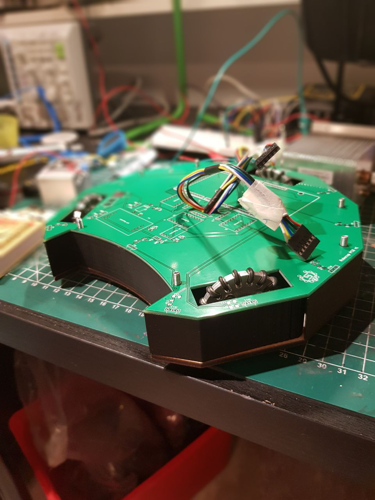

### IMPORTANT NOTICE FOR DEVELOPERS:  
YOUR CURRENTLY LOOKING AT THE DEVELOPMENT BRANCHE - THIS IS UNSTABLE. FOR STABLE CODE, USE MASTER.  

  

  <h3 align="center">Robocup Codebase (2021 edition)</h3>

  

    RoboRevanche, Corderius College 
     
     
    <a href="https://gitlab.com/radiolivestreams/RBCJr-2020/-/wikis/"><strong>Explore the docs »</strong></a>
     
    <a href="https://www.youtube.com/channel/UCj0sl_Kz9CcmMENleEYnSfg">View Demo / Videos »</a>
     
    <a href="https://gitlab.com/radiolivestreams/RBCJr-2020/-/issues">Report Bug</a>
  

## About The Project

We're a team of young developers from a school in Amersfoort, The Netherlands, and we have always been interested in robotics. 
After some time, we decided that we were ready for building our first competitive robot. We loved the awesome vibe that we got at the events and never stopped developing robots. This year (originally last year but Covid decided to pop around 😉), we are combining forces with a different school from the area, creating a team that is playing for all schools that are part of the Meerwegen Scholengroep. Stick around and be sure to check out our codebase if you're interested. Keep an eye out, we'll see you at the event :)

### Built With

Our robot would'nt've made it without these guys, check them out! Thanks everyone for letting us use your products :)
* [C++](https://isocpp.org/)
* [JLCPCB](https://jlcpcb.com/)
* [Corderius College](https://corderius.nl)
* [Leaphy](https://leaphy.nl)
* [Meerwegen Scholengroep](https://meerwegen.nl)
* [PlatformIO](https://platformio.org/)
* [Arduino](https://arduino.cc)

## Getting started

Want to get started with your Soccerbot? Use this information and code away! Do note that this codebase ONLY works on Windows devices. We're hoping to extend to other platforms in a later state.

### Prerequisites

In order to utilize our codebase, please make sure that you have your robot at hand, assembled and ready to go (indicator lights illuminate green). Please connect your robot to your device.

### Installation
1. Install [Visual Studio Code](https://code.visualstudio.com/), it's free.
2. Open Visual Studio Code and [install PlatformIO](https://platformio.org/install/ide?install=vscode)
3. Create a new project and open your terminal using Ctrl+`
4. Clone our repository by typing the following command in the terminal:
   `
   git clone https://gitlab.com/radiolivestreams/RBCJr-2020.git
   `
5. In the file manager (Visual Studio Code), expand the new folder. It contains our codebase.
6. Code away!

By the way, if you want to upload the code to your robot, try running the following command in the terminal: 
`
pio run -t upload
`

## Contributing

Contributions are what make the open source community such an amazing place to be learn, inspire, and create. Any contributions you make are **greatly appreciated**.

1. Fork the Project
2. Create your Feature Branch (`git checkout -b feature/AmazingFeature`)
3. Commit your Changes (`git commit -m 'Add some AmazingFeature'`)
4. Push to the Branch (`git push origin feature/AmazingFeature`)
5. Open a Pull Request 

## License

Distributed under the MIT License. See [`LICENSE`](https://gitlab.com/radiolivestreams/RBCJr-2020/-/blob/master/LICENSE) for more information.

## Contact
Jonathan C - [@jobcremers_](https://instagram.com/jobcremers_) - job@jobcremers.com
(Boys voeg jullie dingen hier ook ff toe ofzo)

Project Link: [https://gitlab.com/radiolivestreams/RBCJr-2020/](https://gitlab.com/radiolivestreams/RBCJr-2020/)
